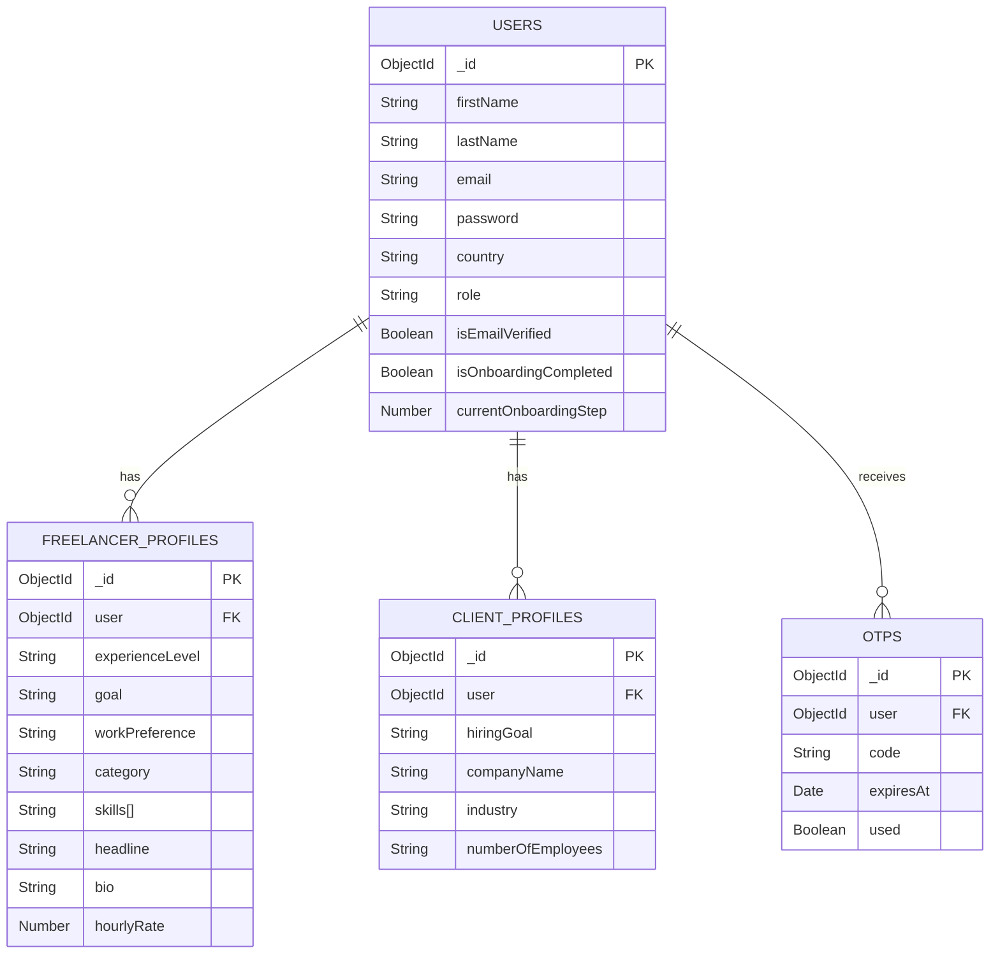

 # User Management & Onboarding Specification

 **Version:** 1.1 • **Module:** Authentication & Profiles • **Tech Stack:** Node.js, Express, MongoDB (Mongoose)

 ---

 ## 1. Overview ✅

 The User Management module handles user creation, email verification, and role-specific onboarding. The entry flow is:

 - Role selection (Client or Freelancer) → Registration form → Email OTP verification → Role-specific onboarding wizard

 ### Core Workflow

 - **Role selection:** user chooses **Client** or **Freelancer** (frontend step).
 - **Registration:** user submits name, email, password, country and selected role.
 - **Account creation:** backend creates a `User` record with the chosen role.
 - **Verification:** OTP sent to email; on success the user receives an auth token and is routed to appropriate onboarding.

## 1.1 Visual diagrams 🔍

Below are two Mermaid diagrams to make the signup, verification, and onboarding flows easier to understand: a **flowchart** for the user management flow and an **ER diagram** showing the main classes/collections and relationships.

> Note: These are Mermaid diagrams — they render on platforms that support Mermaid (GitHub, some Markdown viewers). If your editor doesn't render them, you can copy the code into a Mermaid live editor (https://mermaid.live).

### User management flowchart ✅

```mermaid
flowchart TD
  A[Role selection (Client / Freelancer)] --> B[Registration: POST /auth/signup]
  B --> C[Create User (isEmailVerified: false)]
  C --> D[Send OTP to email]
  D --> E[Verify OTP: POST /auth/verify-otp]
  E --> F{OTP valid?}
  F -- Yes --> G[Mark user.isEmailVerified = true]
  G --> H[Return auth token & role]
  H --> I{role == 'freelancer' ?}
  I -- Yes --> J[Redirect to /onboarding/freelancer]
  I -- No --> K[Redirect to /onboarding/client]
  F -- No --> L[Reject / allow resend (POST /auth/resend-otp)]
  J --> M[PATCH /freelancer/onboarding (incremental saves)]
  K --> N[PATCH /client/onboarding (incremental saves)]
  M --> O[Set isOnboardingCompleted = true when finished]
  N --> O
```

### Class / ER diagram 🧩



**How to read these diagrams:**
- Flowchart: follows the happy path (registration → verification → onboarding) and shows error paths (resend OTP, failed verification).
- ER diagram: shows `User` as the central auth/status collection, with one-to-one (unique) or one-to-many relationships to role profiles and OTPs.

---

 ## 2. Database Schema Design (Mongoose) 🔧

 We use a reference pattern: `User` collection (authentication & status) + role-specific profile collections (`FreelancerProfile`, `ClientProfile`).

 ### 2.1 User collection (authentication)

 Captured during registration.

 ```javascript
 const userSchema = new mongoose.Schema({
	 firstName: { type: String, required: true },
	 lastName: { type: String, required: true },
	 email: { type: String, required: true, unique: true, lowercase: true },
	 password: { type: String, required: true, select: false },
	 country: { type: String, required: true },

	 role: { type: String, enum: ['freelancer', 'client'], required: true },

	 hasAgreedToTerms: { type: Boolean, required: true },

	 isEmailVerified: { type: Boolean, default: false },
	 isOnboardingCompleted: { type: Boolean, default: false },
	 currentOnboardingStep: { type: Number, default: 1 },

	 createdAt: { type: Date, default: Date.now }
 });
 ```

 ### 2.2 Freelancer profile

 Captured progressively during the freelancer wizard.

 ```javascript
 const freelancerProfileSchema = new mongoose.Schema({
	 user: { type: mongoose.Schema.Types.ObjectId, ref: 'User', unique: true },

	 experienceLevel: { type: String, enum: ['entry', 'intermediate', 'expert'] },
	 goal: { type: String, enum: ['side_income', 'main_income', 'experience'] },
	 workPreference: { type: String, enum: ['opportunities', 'packages', 'both'] },

	 category: { type: String },
	 skills: [String],

	 headline: { type: String, maxlength: 70 },
	 bio: { type: String },

	 workHistory: [/* sub-schema */],
	 education: [/* sub-schema */],

	 languages: [/* sub-schema */],
	 hourlyRate: { type: Number },

	 profilePic: { type: String },
	 phoneNumber: { type: String },
	 address: { /* street, city, zip */ }
 });
 ```

 ### 2.3 Client profile

 Captured progressively during the client wizard.

 ```javascript
 const clientProfileSchema = new mongoose.Schema({
	 user: { type: mongoose.Schema.Types.ObjectId, ref: 'User', unique: true },

	 hiringGoal: { type: String, enum: ['one_time_project', 'ongoing_work', 'browsing'] },

	 companyName: { type: String },
	 industry: { type: String },
	 numberOfEmployees: { type: String, enum: ['1-10', '11-50', '50-250', '250+'] },
	 website: { type: String },

	 roleInCompany: { type: String },

	 phoneNumber: { type: String },
	 linkedInProfile: { type: String },

	 isPaymentVerified: { type: Boolean, default: false },
	 totalSpent: { type: Number, default: 0 }
 });
 ```

 ---

 ## 3. Step-by-step logic ⚙️

 ### Phase 1 — Sign up & verification

 1. **Role selection (frontend)** — show two cards: *Join as a Client* / *Join as a Freelancer*. Store selection in UI state (e.g., `selectedRole`).
 2. **Registration** — submit `POST /auth/signup` with `{ firstName, lastName, email, password, country, role, hasAgreedToTerms }`.
 3. **OTP** — send code by email; `POST /auth/verify-otp` verifies and returns an auth token and the user role.

 Example signup payload:

 ```json
 {
	 "firstName": "John",
	 "lastName": "Doe",
	 "email": "john@example.com",
	 "password": "secretPassword123",
	 "country": "USA",
	 "role": "freelancer",
	 "hasAgreedToTerms": true
 }
 ```

 ### Phase 2 — Role-specific onboarding (wizard)

 - Use **incremental save** (PATCH per page) so users can skip and resume.
 - The frontend decides which wizard to show based on `user.role` returned from verification.

 #### Freelancer onboarding (PATCH /api/freelancer/onboarding)

 | Page | Question / UI | Example payload |
 |---|---|---|
 | 1 | Experience & Goal | `{ "experienceLevel": "intermediate", "goal": "main_income" }` |
 | 2 | Work preference | `{ "workPreference": "opportunities" }` |
 | 3 | Category & Skills | `{ "category": "Web Dev", "skills": ["React","Node"] }` |
 | 4 | Headline & Bio | `{ "headline": "Expert Node Dev", "bio": "I have 5 years..." }` |
 | 5 | Work history & education | `{ "workHistory": [...], "education": [...] }` |
 | 6 | Languages & rate | `{ "languages": [...], "hourlyRate": 45 }` |
 | 7 | Personal details (finish) | `{ "profilePic": "url", "phoneNumber": "...", "isOnboardingFinished": true }` |

 #### Client onboarding (PATCH /api/client/onboarding)

 | Page | Question / UI | Example payload |
 |---|---|---|
 | 1 | Hiring goals | `{ "hiringGoal": "one_time_project" }` |
 | 2 | Company info | `{ "companyName": "TechStart", "industry": "IT", "numberOfEmployees": "1-10", "website": "..." }` |
 | 3 | Your role | `{ "roleInCompany": "HR Manager" }` |
 | 4 | Contact & finish | `{ "phoneNumber": "+123456789", "isOnboardingFinished": true }` |

 **Skip logic:** send `{ "currentOnboardingStep": <nextStep> }` to advance without validating page fields.

 **Completion trigger:** when `isOnboardingFinished` is true (or backend validates final step), set `User.isOnboardingCompleted = true` and reveal public profile / redirect accordingly.

 ---

 ## 4. API specification 📡

 | Endpoint | Method | Description |
 |---|---:|---|
 | `/auth/signup` | POST | Create account (requires `role`) |
 | `/auth/resend-otp` | POST | Resend OTP to email |
 | `/auth/verify-otp` | POST | Verify email using OTP |
 | `/auth/login` | POST | Login with email & password |
 | `/freelancer/onboarding` | PATCH | Incremental updates to a freelancer's profile |
 | `/client/onboarding` | PATCH | Incremental updates to a client's profile |
 | `/users/me` | GET | Return current user status (role, onboarding status, current step) |

 Example: `POST /auth/verify-otp` body: `{ "email": "john@example.com", "otpCode": "123456" }`

 ---

 ## 5. Implementation notes & checklist ✅

 - **Frontend routing:**
	 - `user.role === 'freelancer'` → `/onboarding/freelancer/*`
	 - `user.role === 'client'` → `/onboarding/client/*`
 - **State:** hold the role selection in local UI state until the registration POST.
 - **Validation:** allow optional fields where users can skip (e.g., company website, linkedIn). Enforce required fields at submission/finish where appropriate.
 - **Security:** store passwords hashed, OTP expiry, rate-limit OTP attempts.
 - **Post-onboarding:**
	 - Freelancers → redirect to **Find Work (Job Feed)**
	 - Clients → redirect to **Post a Job**

 ---

 ## Notes / Changes made ✨

 - Removed duplicate content and improved structure, added proper code fences, tables for onboarding pages and API spec, clarified skip & completion logic.

 ---

## Local setup & run ✅

1. Copy `.env` to `.env` and set `MONGO_URI` and `PORT`.
2. Install dependencies: `npm install` (already installed core deps).
3. Start in development mode: `npm run dev` (uses `nodemon`).
4. Check health: `GET /` should respond `API is running...`.
5. Users API: `GET /api/users`, `POST /api/users` to create a test user.

> **Tip:** For production, set `NODE_ENV=production` and use a process manager (PM2, systemd) and secure environment variables.

---
